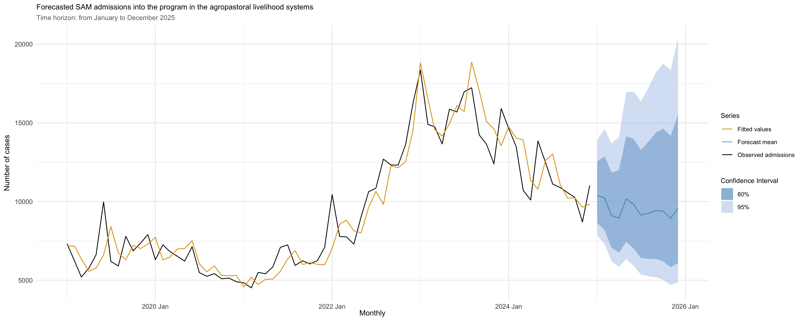

# Looking ahead: future severe acute malnutrition (SAM) cases into the treatment program in Somalia

## A time series-based forecast

Severe acute malnutrition can lead to death when untreated. Its timely
identification and treatment are essential to prevent a fatal outcome.
To that end, it is paramount to have early information on its future
evolution, in order to inform evidence-based and strategic
decision-making. Current (and traditional) approaches for estimating
programme caseload, though they provide information on the expected
caseload over 12 months (usually, based on the *NxPxKxC* formula), they
do not provide useful and actionable insights on the variation of the
estimated caseloads across the months by showing its trend and seasonal
variation (if existent), limiting, therefore, the ability of programme
managers to strategic decision for times during the year when cases are
expected to rise or fall.

In this repo, I try to address this gap by forecasting the SAM caseload
in Somalia between January and December 2025, based on the information
available in the historical SAM admissions from the past 72 months (5
years). The model does not try to account for new external inputs
(dynamic or adaptative forecasting) or find any drivers (explanatory
forecasting). This is a pure time series model.

Forecasts are done for a horizon of 12 months, as of January 2025, and
they are split into the four main Somalia livelihood systems. A glance
at the forecasted SAM cases in one livelihood system is shown below:

The above results seem to provide actionable insights for anticipatory
action, which could include resource mobilization and scaling up of
outreach activities over the months when SAM is expected to increase.
Forecasting acute malnutrition through time series offers several
advantages:

- it allows to anticipate the rise in the number of cases.  
- it supports resource mobilization and allocation.  
- It strengthens early warning systems.
- And it helps to save lives.

## Repository Structure

- `raw-data/`: a data frame of the input data. This is encrypted.
- `R/`: some handy user-defined functions.
- `scripts/`: a set of `R` scripts. These are split into different
  files, based on the specific task that they execute.

The following workflow is recommended:

The above flowchart can be implemented simply by running the `scrip.R`
file found in the root directory.

## Reproducibility information

The repository was created in `R` version 4.5.0 This project uses the
`{renv}` framework to record `R` package dependencies and versions.
Packages and versions used are recorded in `renv.lock` and code used to
manage dependencies is in `renv/` and other files in the root project
directory. On starting an `R` session in the working directory, run
`renv::restore()` to install R package dependencies.

## Data encryption

This project uses `{cyphr}` to encrypt the raw data that lives in
`data-raw/` directory. In order to be able to access and decrypt the
encrypted data, the user will need to have created their own personal
SSH key and make a request to be added to the project. An easy-to-grasp
guide on how to make a request will be found
[here](https://github.com/OxfordIHTM/cyphr-encryption-demonstration#).

## License

This repository is licensed under a GNU General Public License 3
(GPL-3).

## Feedback

If you wish to give feedback, file an issue or seek support, kindly do
so [here](https://github.com/nutspatial/ugd-karamoja-amn-interp/issues).

## Useful resource

[Forecasting Seasonal Acute Malnutrition: Setting the
Framework](https://journals.sagepub.com/doi/10.1177/03795721231202238).

## Author

Tomás Zaba
